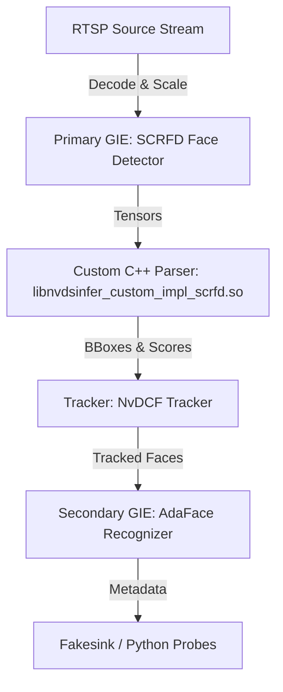

# DeepStream Surveillance Pipeline Integration (SCRFD + AdaFace)

This directory contains the configurations, models, and custom C++ output parser for running the hardware-accelerated surveillance pipeline using the NVIDIA DeepStream SDK.

---

## 📋 Table of Contents
1. [Overview of the Pipeline](#-overview-of-the-pipeline)
2. [Prerequisites & Host Environment Setup](#-prerequisites--host-environment-setup)
   - [Step A: Install Docker (If Missing)](#step-a-install-docker-if-missing)
   - [Step B: Install NVIDIA GPU Drivers](#step-b-install-nvidia-gpu-drivers)
   - [Step C: Install NVIDIA Container Toolkit](#step-c-install-nvidia-container-toolkit)
3. [Step-by-Step Running Guide (A-Z)](#-step-by-step-running-guide-a-z)
   - [Step 1: Start the Docker Container](#step-1-start-the-docker-container)
   - [Step 2: Compile the Custom Parser (Inside Container)](#step-2-compile-the-custom-parser-inside-container)
   - [Step 3: Run the DeepStream Pipeline](#step-3-run-the-deepstream-pipeline)
4. [What Made the App Run Successfully? (Key Changes)](#-what-made-the-app-run-successfully-key-changes)
5. [Understanding Pipeline Outputs & PERF Scores](#-understanding-pipeline-outputs--perf-scores)

---

## 🔍 Overview of the Pipeline

Your DeepStream application (`deepstream-app`) orchestrates a GStreamer multimedia pipeline:



1. **Source**: Decodes an RTSP camera stream (`${CAMERA_URL}`).
2. **Primary AI (`nvinfer`)**: Runs hardware-accelerated inference using the **SCRFD face detector** (`scrfd_10g_bnkps.onnx`).
3. **Custom Parser (`libnvdsinfer_custom_impl_scrfd.so`)**: Dynamically parses the raw output tensors of the SCRFD model (class scores and box offsets across strides 8, 16, and 32) into DeepStream bounding box metadata.
4. **Tracker (`nvds_nvmultiobjecttracker`)**: Tracks detected faces frame-to-frame using the highly optimized NvDCF tracking algorithm.
5. **Secondary AI (`nvinfer`)**: Extracts face embeddings from the tracked face bounding boxes using **AdaFace** (`adaface.onnx`).
6. **Sink**: Outputs/discards video frames headlessly (`fakesink`) since inference metadata is processed downstream in Python probes.

---

## 🛠 Prerequisites & Host Environment Setup

To run a DeepStream container, your host machine must have Docker, NVIDIA drivers, and the NVIDIA Container Toolkit installed. If you lack any of these components, follow the steps below.

### Step A: Install Docker (If Missing)
If Docker is not installed on your system, execute the following commands to install it:

```bash
# 1. Update package index and install dependencies
sudo apt-get update
sudo apt-get install -y ca-certificates curl gnupg

# 2. Add Docker's official GPG key
sudo install -m 0755 -d /etc/apt/keyrings
curl -fsSL https://download.docker.com/linux/ubuntu/gpg | sudo gpg --dearmor -o /etc/apt/keyrings/docker.gpg
sudo chmod a+r /etc/apt/keyrings/docker.gpg

# 3. Set up the stable repository
echo \
  "deb [arch=$(dpkg --print-architecture) signed-by=/etc/apt/keyrings/docker.gpg] https://download.docker.com/linux/ubuntu \
  $(. /etc/os-release && echo "$VERSION_CODENAME") stable" | \
  sudo tee /etc/apt/sources.list.d/docker.list > /dev/null

# 4. Install Docker Engine
sudo apt-get update
sudo apt-get install -y docker-ce docker-ce-cli containerd.io docker-buildx-plugin docker-compose-plugin

# 5. Enable and start Docker service
sudo systemctl enable --now docker

# 6. Optional: Allow running Docker without sudo (requires terminal restart)
sudo usermod -aG docker $USER
newgrp docker
```

---

### Step B: Install NVIDIA GPU Drivers
DeepStream requires your NVIDIA GPU drivers to be installed on the host. 

```bash
# 1. Check if drivers are already installed
nvidia-smi

# 2. If command not found, install the recommended driver version
sudo ubuntu-drivers install
# Or install a specific version, e.g., sudo apt install nvidia-driver-535

# 3. Reboot the host system
sudo reboot
```

---

### Step C: Install NVIDIA Container Toolkit
The NVIDIA Container Toolkit allows Docker containers to utilize your GPU. Without this, `--gpus all` flags will fail.

```bash
# 1. Configure the package repository
curl -fsSL https://nvidia.github.io/libnvidia-container/gpgkey | sudo gpg --dearmor -o /usr/share/keyrings/nvidia-container-toolkit-keyring.gpg \
  && curl -s -L https://nvidia.github.io/libnvidia-container/stable/deb/nvidia-container-toolkit.list | \
    sed 's#deb https://#deb [signed-by=/usr/share/keyrings/nvidia-container-toolkit-keyring.gpg] https://#g' | \
    sudo tee /etc/apt/sources.list.d/nvidia-container-toolkit.list

# 2. Install the toolkit
sudo apt-get update
sudo apt-get install -y nvidia-container-toolkit

# 3. Configure Docker to use NVIDIA runtime
sudo nvidia-ctk runtime configure --runtime=docker

# 4. Restart Docker to apply changes
sudo systemctl restart docker

# 5. Verify the installation (should output your GPU info inside the container)
docker run --gpus all --rm nvidia/cuda:12.0.0-base-ubuntu22.04 nvidia-smi
```

---

## 🚀 Step-by-Step Running Guide (A-Z)

Follow these steps in sequence to compile and run your DeepStream surveillance pipeline.

### Step 1: Start the Docker Container
Run the following command from the root of your workspace (`/home/ajmunna/Workspace/TDI Workspace/Munna/ha_meem_ai_surveillance`) to launch a DeepStream 7.0 container:

```bash
docker run --gpus all -it --rm --net=host \
    -v "/home/ajmunna/Workspace/TDI Workspace/Munna/ha_meem_ai_surveillance:/app" \
    nvcr.io/nvidia/deepstream:7.0-triton-multiarch bash
```

> [!NOTE]
> * `--gpus all`: Passes all host GPUs to the container.
> * `--net=host`: Uses the host's network stack (crucial for RTSP stream inputs).
> * `-v "...:/app"`: Mounts your workspace to `/app` inside the container for hot-reloading and direct edits.

---

### Step 2: Compile the Custom Parser (Inside Container)
The custom parser decodes output bounding boxes and scores from the SCRFD model. If you modify `custom_parser/nvdsinfer_custom_parser_scrfd.cpp` on your host, compile the C++ source file into a shared object (`.so`) inside the running container:

```bash
# 1. Navigate to the parser folder
cd /app/deepstream-sdk-map/custom_parser

# 2. Compile the parser
g++ -shared -fPIC -o libnvdsinfer_custom_impl_scrfd.so \
    nvdsinfer_custom_parser_scrfd.cpp \
    -I/opt/nvidia/deepstream/deepstream/sources/includes \
    -I/usr/local/cuda/include \
    -O3 -std=c++17
```

---

### Step 3: Run the DeepStream Pipeline
Once the parser compiles successfully, navigate to the config folder and start the application:

```bash
# 1. Navigate to the config folder
cd /app/deepstream-sdk-map/configs

# 2. Launch the master configuration
deepstream-app -c ha_meem_master_config.txt
```

---

## 🛠 What Made the App Run Successfully? (Key Changes)

We resolved three critical issues to stabilize and successfully run this pipeline:

### 1. Fixed TensorRT Spatial Shape Compilation Error
* **Problem**: The original SCRFD model had dynamic input spatial dimensions `[1, 3, '?', '?']`. TensorRT failed to compile it under DeepStream because no optimization profile was defined.
* **Fix**: Programmatically modified the ONNX input dimensions to static `640x640` spatial dimensions: `['batch_size', 3, 640, 640]`.

### 2. Resolved Memory Out-of-Bounds Violations (`cudaErrorIllegalAddress`/`cudaErrorMisalignedAddress`)
* **Problem**: The original model's output tensors lacked a batch dimension (e.g. `[12800, 1]`). In DeepStream's default *implicit batch mode*, `nvinfer` stripped the first dimension (`12800`) as the batch dimension, leaving an allocated buffer size of only `1` float for scores and `4` floats for coordinates. When the custom parser tried to loop over all 12,800 anchors, it accessed out-of-bounds memory on the GPU.
* **Fix**: Programmatically inserted a dynamic batch dimension into all model outputs: `['batch_size', 12800, 1]`, `['batch_size', 12800, 4]`, etc. TensorRT was then forced to retain the full buffer size at runtime.

### 3. Created a C++ Custom Bounding Box Parser for SCRFD
* **Problem**: The original config file referenced `NvDsInferParseYolo` from the default library, which does not exist in DeepStream 7.0 and would have decoded the coordinates incorrectly (since SCRFD has a different stride/anchor mechanism than YOLO).
* **Fix**: Wrote a custom C++ bounding box parser (`custom_parser/nvdsinfer_custom_parser_scrfd.cpp`) matching the anchor-based multi-stride decoding scheme of the original Python code. We compiled it into a shared object (`libnvdsinfer_custom_impl_scrfd.so`) inside the container.

---

## 📊 Understanding Pipeline Outputs & PERF Scores

The performance tracker periodically outputs logs to the terminal:

```text
**PERF:  19.68 (6.94)
**PERF:  0.67 (6.63)
**PERF:  0.00 (6.33)
```

* **Current FPS (e.g., `19.68` / `0.67`)**: The instantaneous processing speed (Frames Per Second) of the pipeline.
* **Average FPS (e.g., `6.94`)**: The overall average processing speed since the pipeline transitioned to the `PLAYING` state.
* **Why did the FPS fluctuate?**
  1. **Network Packet Loss/Lag**: The warnings `Could not receive any UDP packets for 5.0000 seconds` indicate that the RTSP connection over UDP was blocked or lagged. 
  2. **TCP Fallback**: When the connection fell back to TCP, frames were buffered and delivered in bursts. This caused the processing rate to alternate between very high rates (when processing buffered bursts) and `0.00` (when waiting for new packets).
  3. **Stability**: Once the network transmission stabilizes, the FPS will consistently match your RTSP stream's output rate (usually 20 or 25 FPS).
