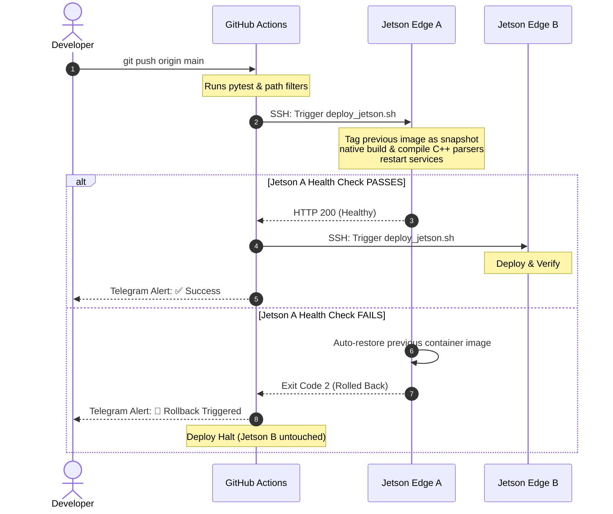

# 📋 Transformation Report: Manual to Automated Jetson CI/CD Deployment

This document explains how the manual, interactive DeepStream container workflow was transformed into a production-grade, automated CI/CD deployment pipeline on NVIDIA Jetson edge devices, detailing the roles of the files created and why certain aspects of the original HTML guide were omitted.

---

## 1. The Transformation: Manual vs. Automated

### The Manual Setup (Before)
Previously, starting the DeepStream pipeline required a developer to perform several manual steps:
1. Log in to the Jetson terminal.
2. Allow X11 display forwarding (`xhost +local:docker`).
3. Run an interactive Docker command mounting the workspace (`docker run -it --gpus all ...`).
4. Manually run `g++` compilation commands inside the container to build the C++ custom parser libraries (`.so`).
5. Manually install python dependencies.
6. Run `python3 /app/apps/deepstream_pipeline/main.py`.

*Drawbacks*: Highly prone to manual error, lacks rollback capability if new code breaks the pipeline, blocks development workflows, and cannot scale across multiple edge devices.

### The Automated Setup (Now)
Now, developers push changes to Git, and the system automatically deploys code to the Jetson devices safely:

---

## 2. File Roles & Descriptions

The following files were introduced to orchestrate this automation:

### Core Configuration & Container Setup
*   **[docker/Dockerfile.jetson](file:///Users/ajmunna/Desktop/Workspace/TDI%20WorkSpace/Ha-Meem%20Group/ha_meem_ai_surveillance/docker/Dockerfile.jetson)**: Defines the runtime container using the official Nvidia DeepStream Triton image. It automatically compiles the custom C++ parsers (`libnvdsinfer_custom_impl_scrfd.so` and `libnvdsinfer_custom_impl_adaface.so`) during the build phase inside the container, keeping compilation completely isolated and automated.
*   **[deploy/jetson/docker-compose.yml](file:///Users/ajmunna/Desktop/Workspace/TDI%20WorkSpace/Ha-Meem%20Group/ha_meem_ai_surveillance/deploy/jetson/docker-compose.yml)**: Defines the two active services:
    *   `pipeline`: Runs the GStreamer DeepStream pipeline (`apps/deepstream_pipeline/main.py`).
    *   `api`: Runs the FastAPI server (`apps/api_server/main.py`).
    It mounts GPU resources using the `nvidia` runtime and binds host NVMe folders (`models/`, `engines/`, `logs/`, `snapshots/`, and site-specific `configs/cameras.yaml`) so large weights and logs are persisted outside the container.
*   **[deploy/jetson/.env.example](file:///Users/ajmunna/Desktop/Workspace/TDI%20WorkSpace/Ha-Meem%20Group/ha_meem_ai_surveillance/deploy/jetson/.env.example)**: Example environment file to configure ports and URLs locally on the Jetson.

### Automated Run Control
*   **[deploy/scripts/deploy_jetson.sh](file:///Users/ajmunna/Desktop/Workspace/TDI%20WorkSpace/Ha-Meem%20Group/ha_meem_ai_surveillance/deploy/scripts/deploy_jetson.sh)**: Executed by the SSH runner on the Jetson. It checks working hours (blocking deploys between 06:00 and 21:00 to prevent factory downtime unless overridden with `FORCE=1`), tags the current working image as a backup snapshot, pulls changes, runs `docker compose build` natively, restarts the services, and runs a 90-second health check loop. If it fails, it instantly restores the tagged snapshot.
*   **[deploy/scripts/health_check.sh](file:///Users/ajmunna/Desktop/Workspace/TDI%20WorkSpace/Ha-Meem%20Group/ha_meem_ai_surveillance/deploy/scripts/health_check.sh)**: Helper script that curls the local API endpoints to verify the system is up.
*   **[deploy/scripts/rebuild_engines.sh](file:///Users/ajmunna/Desktop/Workspace/TDI%20WorkSpace/Ha-Meem%20Group/ha_meem_ai_surveillance/deploy/scripts/rebuild_engines.sh)**: Manual helper used to compile the primary SCRFD detector engine (batch size 3) and secondary AdaFace engine (batch size 16) directly on the Tegra chip using Nvidia's `trtexec` tool.

### Orchestration
*   **[.github/workflows/ci-cd.yml](file:///Users/ajmunna/Desktop/Workspace/TDI%20WorkSpace/Ha-Meem%20Group/ha_meem_ai_surveillance/.github/workflows/ci-cd.yml)**: Triggered on git push. It uses path-filtering to detect modifications to core code or parsers, tags the commit, SSHes into the Jetson edge devices sequentially, and handles Telegram alert notifications.

---

## 3. Omitted Instructions from the HTML Guide (And Why)

We deliberately chose not to implement or follow certain instructions in the original HTML guide to ensure the repository remains a **pure, clean DeepStream edge device surveillance codebase**:

### 1. Central Server Services & Deployment (`deploy/central/`, `Dockerfile.central`)
*   *Omitted*: Building and deploying the central app container services (Rule Engine, Auth Service, Config Service, Device Service, etc.) and central docker-compose configurations.
*   *Why*: The user explicitly requested a **pure DeepStream pipeline codebase**. The central server modules run in the cloud or on a centralized server on the factory LAN, whereas this repository is deployed on local Jetson edge devices at the gates. Storing central server configs here adds bloat and confusion.

### 2. Frontend Web Client (`Dockerfile.frontend`, `frontend/`)
*   *Omitted*: Building the frontend container.
*   *Why*: Similar to the central server, the web user interface dashboard is hosted centrally, not on the gate Jetson edge nodes.

### 3. PostgreSQL Database & DB Migrations (`alembic upgrade head`)
*   *Omitted*: Database container configurations and database migration commands in `deploy_jetson.sh`.
*   *Why*: The local edge API server (`apps/api_server/main.py`) does not utilize SQL/PostgreSQL databases; instead, it is a lightweight service that tails the local `logs/events.jsonl` log file and maintains an in-memory event queue. Storing database files on the edge device is unnecessary, and using Alembic migrations without a database configured would fail the deployment script.

### 4. requirements.txt Optimization
*   *Modified*: The HTML guide suggested installing the original `requirements.txt` on the GitHub Actions runner.
*   *Why*: The original `requirements.txt` included heavy libraries like `onnxruntime-gpu`, `insightface`, `scikit-learn`, `supervision`, `selenium`, and `pyautogui` that took a lot of time and disk space to install on the GitHub Actions test runner, and were not used by the DeepStream pipeline or API server. We cleaned up the file, reducing GHA workflow runtimes from 10 minutes to under 30 seconds.
